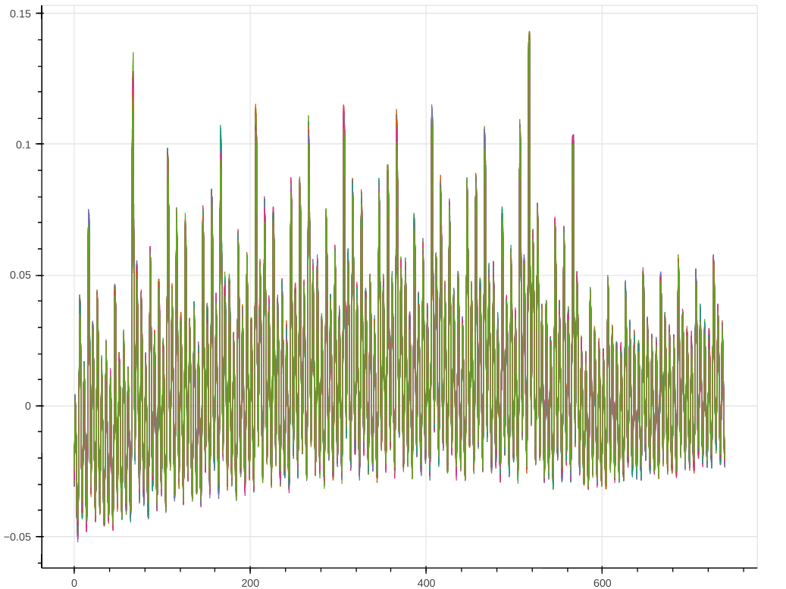

# Getting Started

NOTE: The following will be merged to `getting_started.md`, but to speed along relevant user guides
a separate file has been created for now.

## Prerequisites

### Hardware Requirements

To perform side-channel analysis (SCA) for [OpenTitan](https://github.com/lowRISC/OpenTitan).
using the infrastructure provided in this repository, the following hardware
equipment is required:
* [ChipWhisperer CW310 FPGA Board with K410T](https://rtfm.newae.com/Targets/CW310%20Bergen%20Board//)
  This is the target board. The Xilinx Kintex-7 FPGA is used to implement
  OpenTitan. Note that there are different versions of the board
  available of which the board with the bigger FPGA device (K410T)
  is required.
* ChipWhisperer-


  This is the capture or scope board. It is used to capture power traces of
  OpenTitan implemented on the target board. This board replaces the ChipWhisperer-Lite.


### Software Requirements

Software required by this repository can either be directly installed <del>on a
machine or obtained using the provided [Dockerfile](https://github.com/lowRISC/ot-sca/blob/master/util/docker/Dockerfile)</del> (DOCKERFILE NOT UPDATED FOR HUSKY CURRENTLY).

#### Installing on a Machine

##### Python Dependencies

This repository has a couple of Python dependencies. You can run
```console
$ pip install --user -r python_requirements.txt
```
to install those dependencies.

##### ChipWhisperer Dependencies

Please see [this page](https://chipwhisperer.readthedocs.io/en/latest/prerequisites.html#packages)
to install the packages required by ChipWhisperer.

The ChipWhisperer-Husky requires 5.6.1 or later (current installed from git). The default `python_requirements.txt` will install the version
that Husky requires.

Python 3.6.9 is **ok** for ChipWhisperer - it may force you to use Python 3.7 due to requirements enforced by the latest version of NumPy. This is not a hard requirement.

Note using ChipWhisperer-Lite requires a specific commit of ChipWhisperer due to broken segmenting support, this document assumes only CW-Husky usage however so is not covered.

##### Git Large File Storage (LFS)

This project uses Git LFS for storing binaries like a debian-compatible
pre-built binary of the tool for loading the OpenTitan application binary over
SPI and an example target FPGA bitstream on a remote server. The repository
itself just contains diff-able text pointers to the binaries. It is recommended
to install the `git-lfs` tool for transparently accessing the binaries.
Alternatively, they can be downloaded manually from GitHub.

You can run
```console
$ sudo apt install git-lfs
```
to install the `git-lfs` tool on your Ubuntu machine. You will need to run the following to convert the git-lfs pointers to actual files:
```
git lfs pull
```
Alternatively, you can rebuild those binaries yourself from the
[OpenTitan](https://github.com/lowRISC/OpenTitan) repository.

### Generating OpenTitan Binaries

Instead of using the example binaries provided by this repository via Git LFS,
you can regenerate them from the
[OpenTitan](https://github.com/lowRISC/OpenTitan) repository.

To this end, follow these steps:

1. Go to the root directory of the OpenTitan repository.
1. Build the regular binaries with
```console
$ cd $REPO_TOP
$ ./meson_init.sh
$ ninja -C build-out all
```
   Finally, the bitstream generation can be started by running
```console
$ . /tools/xilinx/Vivado/2020.2/settings64.sh
$ cd $REPO_TOP
$ fusesoc --cores-root . run --flag=fileset_top --target=synth lowrisc:systems:chip_earlgrey_cw310
```
   For more information on the build steps, refer to the
   [OpenTitan FPGA documentation](https://docs.opentitan.org/doc/ug/getting_started_fpga/).

   Note in the above (and follow) we use `$REPO_TOP` to refer to the main OpenTitan repository top, not this `ot-sca` repo.

   The generated bitstream can be found in
```
build/lowrisc_systems_earlgrey_cw310_0.1/synth-vivado/lowrisc_systems_chip_earlgrey_cw310_0.1.bit
```
   and will be loaded to the FPGA using the ChipWhisperer Python API.


## Setup

### Setting up Hardware

To setup the hardware, first connect the boards together. You don't want to accidently short something out with the conductive SMA connector, so first:

* Connect the "SHUNTLOW AMPLIFIED" output (topmost SMA) to the ChipWhisperer-Husky "Pos" input.
* Connect the "ChipWhisperer Connector (J14) on the CW310 to the "ChipWhisperer 20-Pin Connector" on the CW-Husky (this is the connector on the *SIDE* not the connector on the *FRONT*).


Then connect the two boards to your PC via USB-C cables. The CW310 will need a power supply, the default power supply uses a DC barrel connector to supply 12V. If you use this power supply all switches should be in the default position which are:

* `5V Regulator` switch set to `Barrel` (right)
* `FPGA Power Source` switch set to `5V Regulator` (up)
* `Control Power` switch set to on (right, there is no silkscreen marking)
* `Tgt Power` set to `Auto` (right)

You should see the blue "Status" LED on the CW310 blinking, along with several green power LEDs. The "USB-C Power" led may be red as there is no USB-C PD source.

The CW-Husky should also have a green blinking status LED at this point. If LEDs are solid it may mean the device has not enumerated, which might require additional setup:

In addition you might need to setup the following `udev` rules to gain access
to the two USB devices. To do so, open the file
`/etc/udev/rules.d/90-lowrisc.rules` or create it if does not yet exist and add
the following content to it:

```
# NewAE Technology Inc. ChipWhisperer CW310
ACTION=="add|change", SUBSYSTEM=="usb|tty", ATTRS{idVendor}=="2b3e", ATTRS{idProduct}=="c310", MODE="0666"

# NewAE Technology Inc. ChipWhisperer-Husky
ACTION=="add|change", SUBSYSTEM=="usb|tty", ATTRS{idVendor}=="2b3e", ATTRS{idProduct}=="ace5", MODE="0666"
```

To activate the rules, type
```console
$ sudo udevadm control --reload
```
and then disconnect and reconnect the devices.

For more details on how to set up `udev` rules, see the corresponding section
in the [OpenTitan documentation](https://docs.opentitan.org/doc/ug/install_instructions/#xilinx-vivado).


### Configuring the Setup

The main configuration of the OpenTitan SCA analysis setup is stored in the file
```
cw/cw305/capture.yaml
```
For example, this file allows to specify the FPGA bitstream to be loaded and
the OpenTitan application binary to execute. Specify the CW310 files by adjusting the following:

1. `fpga_bitstream: objs/lowrisc_systems_chip_earlgrey_cw310_0.1.bit`
1. `fw_bin` point to the firmware you generated previously (`$OPENTITAN_ROOT$/build-out/sw/device/sca/aes_serial_fpga_cw310.bin`)
1. Increase `num_traces` to at least `2000000`
1. You may need to adjust `scope_gain` -- values around 35 seem OK. You'll view example traces to check your value, described below.

NOTE: You may first want to set `num_traces` to something small (like `5000`) to check the setup. We'll later increase that to at least `2000000` to ensure the attack works. The capture speed of this setup should be around 1300 traces/second, so the large datasets are relatively fast to collect.

#### Disabling Masking

You will probably want to disable masking at first. To do this:

1. Edit the file `sw/device/sca/aes_serial.c` to change `.masking = kDifAesMaskingInternalPrng` to `.masking = kDifAesMaskingForceZero`
1. Run `ninja -C build-out all` to generate new firmware

## Performing Example SCA Attack on AES

SCA attacks are performed in two steps. First, the target device is operated
and power traces are capture. Second, the power traces are analyzed. This is
commonly referred to as the actual SCA attack as performing a different attack
on the same peripheral does not necessarily require the collection of new power
traces.

### Capture Power Traces

Make sure all boards and adapters are powered up and connected to your PC and
that you have adjusted the configuration in `cw/cw305/capture.yaml`
according to your system.

Then run the following commands:

```console
$ cd cw/cw305
$ ./simple_capture_traces_batch.py --scope cw
```
This script will load the OpenTitan FPGA bitstream to the target board, load
and start the application binary to the target via SPI, and then feed data in
and out of the target while capturing power traces on the capture board. It
should produce console output similar to the following output:

```console
Connecting and loading FPGA... Done!
Initializing PLL1
Programming OpenTitan with "objs/aes_serial_fpga_cw310.bin"...
Transferring frame 0x00000000 @             0x00000000.
Transferring frame 0x00000001 @             0x000007D8.
Transferring frame 0x00000002 @             0x00000FB0.
Transferring frame 0x00000003 @             0x00001788.
Transferring frame 0x00000004 @             0x00001F60.
Transferring frame 0x00000005 @             0x00002738.
Transferring frame 0x80000006 @             0x00002F10.
Scope setup with sampling rate 100004734.0 S/s
Reading from FPGA using simpleserial protocol.
Target simpleserial version: z01 (attempts: 1).
Connected to ChipWhisperer (num_samples: 740, num_samples_actual: 740, num_segments_actual: 1)
Using key: '2b7e151628aed2a6abf7158809cf4f3c'.
Capturing: 100%|█████████████████████| 5000/5000 [00:03<00:00, 1374.38 traces/s]
```

In case you see console output like
```console
WARNING:root:Your firmware is outdated - latest is 0.20. Suggested to update firmware, as you may experience errors
See https://chipwhisperer.readthedocs.io/en/latest/api.html#firmware-update
```
you should update the firmware of one or both of the ChipWhisperer boards.
This process is straightforward and well documented online. Simply follow
the link printed on the console.

Once the power traces have been collected, a picture similar to the following
should be shown in your browser:



Note the input data can range from `-0.5` to `+0.5` (this is just an arbitrary
mapping in the current software). If our output value is exceeding those limits
you are clipping and losing data. But if the range is too small (such as the -0.05 
to 0.15 in the example image) you are not using the full dynamic range of the ADC.
You can tune the `scope_gain` setting in the `.yaml` file - around 35 seems to work
well on one setup for example. But boards have some natural variation, and changes such as
the clock frequency, core voltage, and device utilization (fpga build) will all affect
the safe maximum gain setting.

### Perform the Attack

To perform the attack, run the following command:

```console
$ ./ceca.py -f projects/opentitan_simple_aes.cwp -a 505 520 -d output -s 3 -w 16 -n 2000000
```

This will give you an output like this:

```console
INFO:root:Will use 1962961 traces (98.1% of all traces)
2021-10-23 13:19:19,846 INFO ceca.py:520 -- Will use 1962961 traces (98.1% of all traces)
INFO:root:compute_pairwise_diffs_and_scores took 0.4s
2021-10-23 13:19:21,115 INFO _timer.py:61 -- compute_pairwise_diffs_and_scores took 0.4s
INFO:root:Difference values (delta_0_i): [  0 196  41 120  25  62 245  89  49 239 220  24 102 179 220 118]
2021-10-23 13:19:21,116 INFO ceca.py:528 -- Difference values (delta_0_i): [  0 196  41 120  25  62 245  89  49 239 220  24 102 179 220 118]
INFO:root:Recovered AES key: 2b7e151628aed2a6abf7158809cf4f3c
2021-10-23 13:19:21,158 INFO ceca.py:532 -- Recovered AES key: 2b7e151628aed2a6abf7158809cf4f3c
INFO:root:Recovered 82/120 differences between key bytes
2021-10-23 13:19:21,159 INFO ceca.py:538 -- Recovered 82/120 differences between key bytes
INFO:root:perform_attack took 13.6s
2021-10-23 13:19:21,159 INFO _timer.py:61 -- perform_attack took 13.6s
INFO:root:main took 14.7s
2021-10-23 13:19:21,159 INFO _timer.py:61 -- main took 14.7s
```

The setting of `-n 2000000` is how many traces to use, if you receive a memory error reduce
the number of traces.

The setting of `-a 505 520` specifies a location in the power traces, you may need to change
these settings with new FPGA builds as the leakage location will shift.